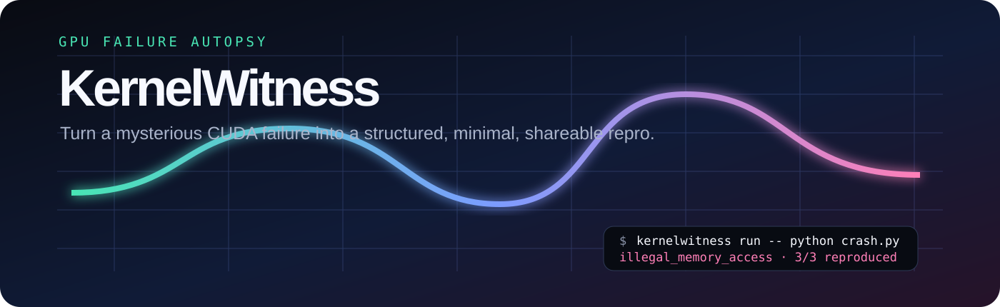
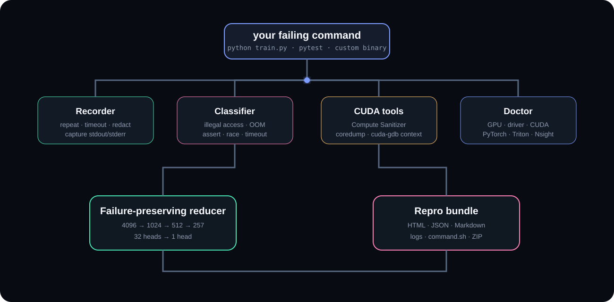

<p align="center">
  
</p>

<p align="center">
  <a href="https://pipelineforge-atlas-production.up.railway.app/kernelwitness"><strong>Open the live sample report →</strong></a><br/><br/>
  <strong>Turn GPU failures into minimal, shareable repro bundles.</strong><br/>
  Reproduce · classify · sanitize · shrink · report
</p>

<p align="center">
  
  
  
  
</p>

---

<p align="center">
  
</p>

A CUDA failure often surfaces far away from the kernel that caused it. KernelWitness wraps the failing command, reproduces the failure, classifies the signature, optionally invokes NVIDIA Compute Sanitizer, captures a redacted environment snapshot, and emits one static report plus a portable repro bundle.

```bash
kernelwitness run --attempts 3 --sanitizer auto -- python train.py
```

```text
Illegal memory access  reproduced 3/3
report  kernelwitness-report/index.html
bundle  kernelwitness-report/kernelwitness-repro.zip
```

## The report is the artifact

<p align="center">
  
</p>

Every run produces:

```text
kernelwitness-report/
├── index.html                  interactive static report
├── report.json                machine-readable schema
├── github.md                  issue-ready summary
├── command.sh                 exact captured command
├── attempts/
│   ├── 01-stdout.txt
│   ├── 01-stderr.txt
│   └── ...
├── sanitizer.txt              when Compute Sanitizer runs
└── kernelwitness-repro.zip    portable bundle
```

No server is needed to open a report.

## Failure-preserving minimization

The reducer does not merely make inputs smaller. It keeps a candidate only when it reproduces the **same classified failure**.

```toml
[repro]
command = ["python", "bug.py", "--seq", "{seq}", "--heads", "{heads}"]
expected = "illegal_memory_access"

[parameters]
seq = [64, 128, 256, 257, 512, 1024, 4096]
heads = [1, 2, 4, 8, 16, 32]
```

```bash
kernelwitness minimize kernelwitness.toml
```

```text
Minimal reproducer found
           seq  257
         heads  1

python bug.py --seq 257 --heads 1
```

That turns a large production configuration into a small issue-ready repro while retaining the bug signature.

## NVIDIA toolchain integration

When present, KernelWitness discovers and records:

| Tool | Integration |
|---|---|
| `nvidia-smi` | GPU, driver, memory, compute capability |
| `nvcc` | CUDA compiler version |
| `compute-sanitizer` | automatic or explicit `memcheck`, `racecheck`, `initcheck`, `synccheck` |
| `cuda-gdb` | debugger availability and coredump workflow |
| `ncu` | Nsight Compute availability |
| `nsys` | Nsight Systems availability |

```bash
kernelwitness doctor
```

Compute Sanitizer findings are normalized into fields such as kernel, source location, thread, block and error type. `--coredump` also configures NVIDIA GPU coredump generation for the target process and asks Compute Sanitizer to generate a coredump when used together. See the official [Compute Sanitizer documentation](https://docs.nvidia.com/compute-sanitizer/ComputeSanitizer/index.html) and [CUDA-GDB documentation](https://docs.nvidia.com/cuda/cuda-gdb/) for platform-specific support details.

## PyTorch async-fault localization

CUDA work is asynchronous, which means the Python line throwing the error can be innocent. For PyTorch scripts, debug mode can synchronize after each dispatched operation:

```bash
kernelwitness torch-trace train.py -- --config repro.yaml
```

When an operation surfaces the device error, KernelWitness prints a structured marker with the PyTorch op index and name. This mode is intentionally slow and intended only for fault localization.

## Silent wrong answers

Crashes are not the only GPU bugs worth reducing. `compare` runs a candidate and an oracle that each print a JSON value, then recursively checks numerical outputs.

```bash
kernelwitness compare   --candidate "python optimized.py"   --oracle "python reference.py"   --atol 1e-5 --rtol 1e-4
```

```text
match=False max_abs=0.0007 max_rel=0.0008 path=$.checksum
```

## Architecture

<p align="center">
  
</p>

The CLI is deliberately split into small modules: recorder, failure classifier, sanitizer parser, environment doctor, reducer, numerical comparator, report renderer, privacy redactor and repro bundler. The core has **zero runtime Python dependencies**.

## Install

From a release wheel:

```bash
pip install kernelwitness
```

From source:

```bash
git clone https://github.com/mneha05/kernelwitness.git
cd kernelwitness
pip install -e .
```

Then:

```bash
kernelwitness doctor
kernelwitness run -- python crash.py
```

## GitHub Actions

The repository includes a composite action for GPU-enabled/self-hosted runners:

```yaml
- uses: mneha05/kernelwitness@v1
  with:
    command: pytest tests/gpu
    sanitizer: memcheck
```

The action uploads `kernelwitness-report/` even when the wrapped command fails, so the debugging artifact survives the CI job.

## GitHub issue export

```bash
kernelwitness export kernelwitness-report/report.json --out issue.md
```

produces a concise Markdown block with the failure signature, reproduction rate, GPU environment and command.

## Privacy by default

Crash output often contains internal paths or credentials. KernelWitness therefore:

- replaces the current home directory with `~` in captured output
- redacts common token, API-key, password and authorization patterns
- never dumps `os.environ`
- does not automatically copy application source into a bundle
- keeps reports completely local unless the user chooses to publish them

See [`SECURITY.md`](SECURITY.md).

## Real CUDA fixtures

With CUDA Toolkit installed, the repository ships intentionally broken kernels for exercising NVIDIA tooling:

```bash
cd examples
make
cd ..

kernelwitness run --sanitizer memcheck -- ./examples/cuda_oob
kernelwitness run --sanitizer racecheck -- ./examples/cuda_race
```

The binaries are compiled with `-lineinfo` so sanitizer findings can resolve source lines.

## Offline test fixture

KernelWitness itself can be tested without a GPU:

```bash
kernelwitness run --attempts 3 --   python examples/simulated_crash.py --seq 257

kernelwitness minimize examples/kernelwitness.toml
```

The fixture emits the same error wording as a CUDA illegal-memory-access path, allowing CI to verify classification, reduction, reporting and bundling on standard runners.

## Scope

KernelWitness does not replace Nsight Compute, Nsight Systems, Compute Sanitizer or CUDA-GDB. It is the layer that turns their evidence plus a failing command into a reproducible artifact somebody else can open, inspect and run.

Current alpha scope:

- command reproduction and classification
- NVIDIA environment capture
- Compute Sanitizer orchestration and parsing
- GPU coredump configuration
- failure-preserving parameter reduction
- PyTorch per-op synchronization tracer
- numerical candidate/oracle comparison
- static HTML + JSON reports
- GitHub Markdown export
- GitHub Actions artifact workflow

Contributions for additional CUDA failure fixtures, Triton/JAX/CuPy adapters and new reduction strategies are welcome. See [`ROADMAP.md`](ROADMAP.md) and [`CONTRIBUTING.md`](CONTRIBUTING.md).

---

<p align="center">
  <strong>Make the bug small enough to hand to someone else.</strong>
</p>
